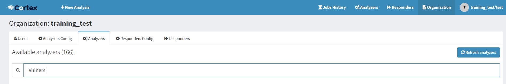
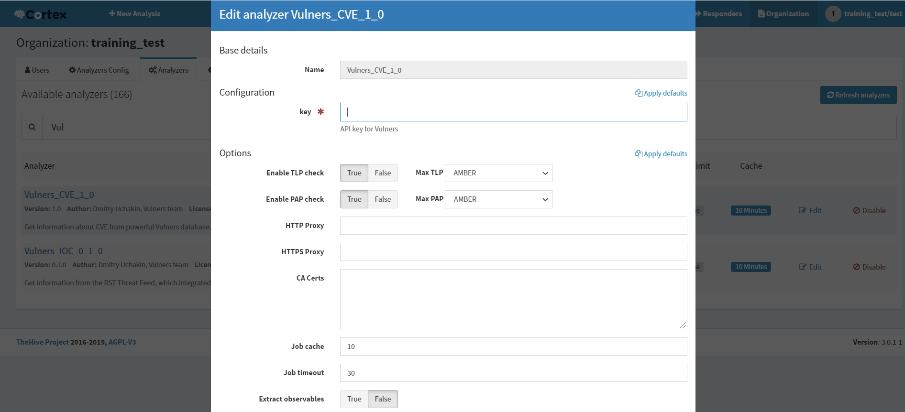
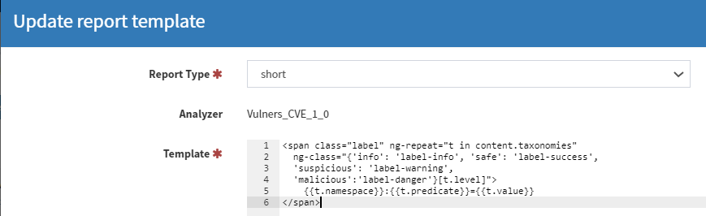
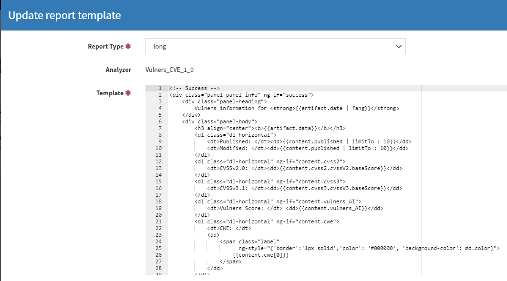
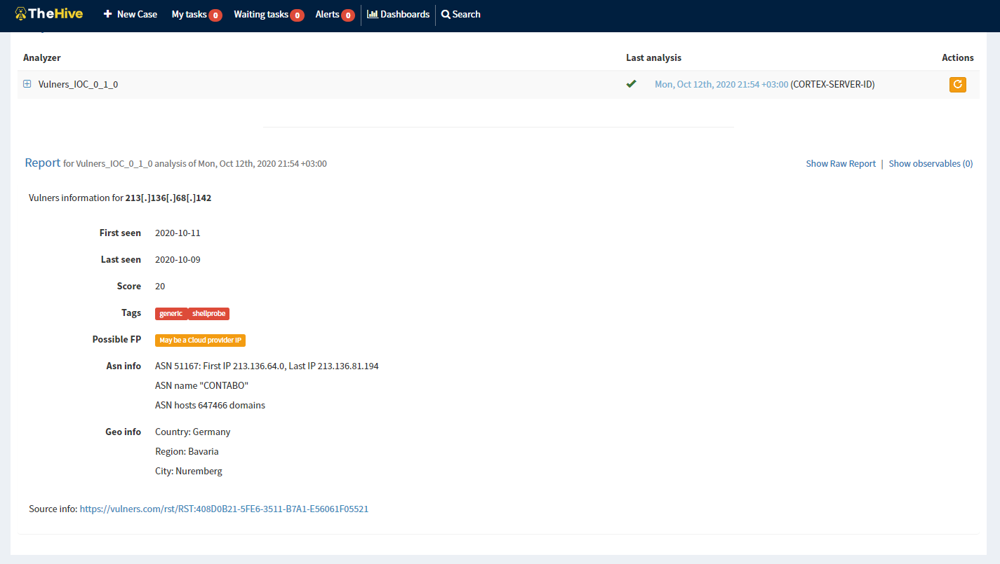
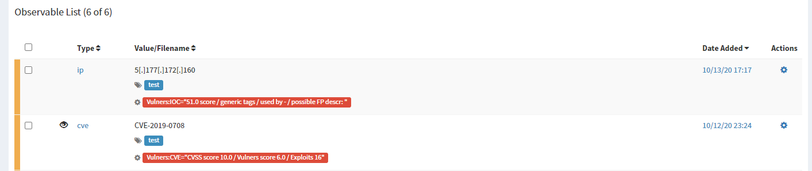

# Vulners-analyzer
 
This analyzer consists of 2 parts.
1. Checks network IOCs by Vulners Rst Threat Feed (including paid part)
2. Useful for vulnerability incidents to get information about vulnerabilities from Vulners database.

Vulners API key required.

## Setting up analyzer

~~~bash
$ git clone https://github.com/uchakin/Vulners-analyzer.git
$ cd Vulners-analyzer/Vulners
$ pip3 install -r requirements
~~~

After install the requirements you need to add Vulners folder to /Cortex-Analyzers/analyzers folder.
~~~bash
$ cp -R Path_where_you_dowloaded_Vulners/Vulners-analyzer/Vulners Path_to_Cortex-Analyzers/Cortex-Analyzers/analyzers/
~~~

## Setting up Vulners analyzer
Log into cortex with an account with the proper privileges then navigate ```Organization>Analyzers``` and click on Refresh analyzers button:
​

After succesfully adding adding to Cortex, you need to enable it with Vulners API key:
​

Per default TheHive has no "CVE" Observable type, so we have to add this in the Admin settings:
​

## Adding templates to TheHive

Log into TheHIVE with an account with the proper privilege level then navigate to ```>USER>Report templates```. 
​

Add both short and long templates for Vulners analyzers:
​

​


### Testing Vulners analyzer (TheHive)

In the observables section add network IOCs to test.

The first one for network IOCs:
​

​

The second one for vulnerabilities:

​
